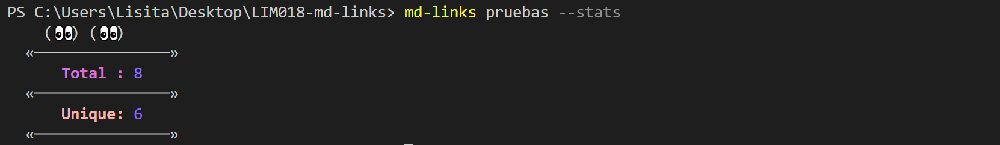
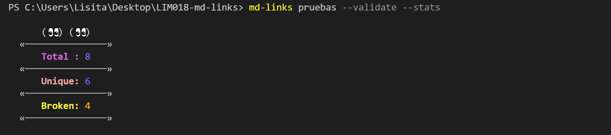
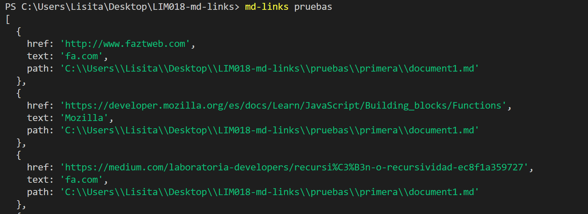
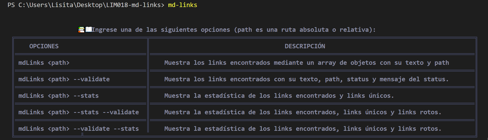

# Markdown Links

## :pushpin: 1. Preámbulo
El Markdwon es un lenguaje de marcado ligero muy popular entre developers. Es usado en muchísimas plataformas que manejan texto plano (GitHub, foros, blogs, ...)

Estos archivos `Markdown` normalmente contienen _links_ (vínculos/ligas) que muchas veces están rotos o ya no son válidos y eso perjudica mucho el valor de la información que se quiere compartir.

Por ello se ha implementado una herramienta usando Node.js ([ingrese aquí](https://www.npmjs.com/package/md-links-stefi)), para que lea y analice archivos en formato `Markdown`, para verificar los links que contengan y reportar algunas estadísticas.


## :pushpin: 2. Diagrama de Flujo :clipboard:

### I. Diagrama API


### II. Diagrama de Interfaz de Línea de Comando (CLI)


## :pushpin: 3. Instrucciones de Instalación  de la librería MD :inbox_tray:

 ###  Interfaz de Línea de Comando (CLI)

 #### A) Instalación

 Para poder instalar el paquete de esta librería, debe ingresar el siguiente comando npm en su terminal:

       npm i md-links-lis

#### B) Ejecución del comando

Para ejecutar los comandos a través del terminal debe ingresar lo siguiente:

       mdLinks <path-to-file> [options]

Donde:

* `path`: Puede ser una Ruta **absoluta** o **relativa** al **archivo** o **directorio**.
* `options`: Un objeto con **únicamente** la siguiente propiedad:
  - `validate`: Determina la validación de los links encontrados.
  - `stats`: Determina las estadisticas totales de los links encontrados.

####  CASO 1 : Cuando " options =  --validate "

Si pasamos la opción `--validate`, el módulo debe hacer una petición HTTP para averiguar si el link funciona o no. Si el link resulta en una redirección a una URL que responde ok, entonces consideraremos el link como ok, caso contrario el mensaje que indicará sera fail.

       mdLinks <path-to-file> --validate

Por ejemplo:

```sh
$ md-links ./some/example.md --validate
./some/example.md http://algo.com/2/3/ ok 200 Link a algo
./some/example.md https://otra-cosa.net/algun-doc.html fail 404 algún doc
./some/example.md http://google.com/ ok 301 Google
```

Vemos que el _output_ en este caso incluye la palabra `ok` o `fail` después de la URL, así como el status de la respuesta recibida a la petición HTTP a dicha URL.
En el terminal:


donde:

* `href`: URL encontrada.
* `text`: Texto que aparecía dentro del link (`<a>`).
* `file`: Ruta del archivo donde se encontró el link.
* `status`: Código de respuesta HTTP.
* `statusText`: Mensaje `fail` en caso de fallo u `ok` en caso de éxito.

####  CASO 2 : Cuando " options =  --stats  "

Si pasamos la opción `--stats` el output (salida) será un texto con estadísticas básicas (total, unique) sobre los links.

       mdLinks <path-to-file> --stats

Ejemplo:

```sh
$ md-links ./some/example.md --stats
Total: 3
Unique: 3
```
En el terminal:



####  CASO 3 : Cuando " options =  -- validate --stats   || --stats -- validate "

También podemos combinar `--stats` y `--validate` para obtener estadísticas que necesiten de los resultados de la validación.


       mdLinks <path-to-file> --validate --stats

       mdLinks <path-to-file> --stats --validate

Ejemplo:

```sh
$ md-links ./some/example.md --stats --validate
Total: 3
Unique: 3
Broken: 1
```

En el terminal:



####  CASO 4 : Cuando " No hay Options"

Cuando no hay options, también podemos ingresar el siguiente comando que nos brindará información sobre el href,  texto y file.

        mdLinks <path-to-file>

ejemplo:



Donde:

* `href`: URL encontrada.
* `text`: Texto que aparecía dentro del link (`<a>`).
* `file`: Ruta del archivo donde se encontró el link.


####  CASO 5 : Cuando " No hay Options ni path ingresados : HELP"

Ingresar el siguiente comando a la terminal, en caso de requerir  ayuda o  indicaciones de uso sobre la librería.

        mdLinks

ejemplo:




**De igual manera, se mostrará el HELP (ayuda) si ingresa un comando  de options erróneos o ajenos  a la librería.**

